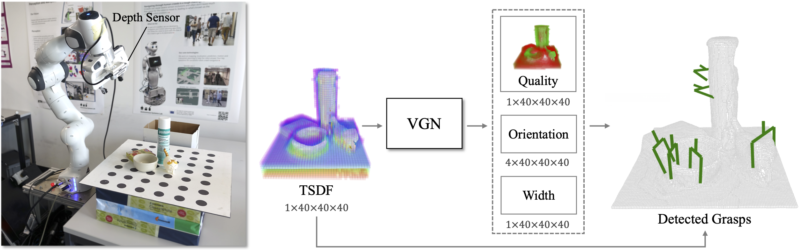

# Volumetric Grasping Network

VGN is a 3D convolutional neural network for real-time 6 DOF grasp pose detection. The network accepts a Truncated Signed Distance Function (TSDF) representation of the scene and outputs a volume of the same spatial resolution, where each cell contains the predicted quality, orientation, and width of a grasp executed at the center of the voxel. The network is trained on a synthetic grasping dataset generated with physics simulation.



## Seraph RTX 3090 Setup

This fork is prepared for ROS-free VGN data generation and training on the Seraph cluster. ROS is not required for:

1. `scripts/generate_data.py`
2. `scripts/construct_dataset.py`
3. `scripts/train_vgn.py`

Recommended environment:

```text
GPU: NVIDIA RTX 3090
Python: 3.10
CUDA runtime for PyTorch: 11.8
PyTorch: conda package with pytorch-cuda=11.8
Open3D: 0.18.0
```

Seraph storage layout for user `allen516`:

```text
/data/datasets/                         NAS, archive datasets only, single tar/zip files
/data/allen516/                         NAS, personal code, conda envs, generated results
/data/allen516/anaconda3/               conda installation location
/data/allen516/vgn_data_generate_train/ this repository
/home/allen516/                         config files only
/local_datasets/                        GPU-node local disk for training dataloader input
```

Important rules:

```text
Do not run Python data generation or training on the master node.
Use srun for interactive debugging and sbatch for long jobs.
Do not point a training dataloader at /data/... paths.
Copy constructed datasets to /local_datasets/ before training.
/local_datasets/ is node-local and may be wiped after the job, so do not use it as the only copy of generated data.
Do not install Anaconda under /home/allen516.
Do not install packages into public Anaconda at /data/opt/anaconda3.
```

Project path design:

```text
/data/allen516/vgn_data_generate_train/
  data/
    raw/packed_sanity/       generated raw VGN data, preserved on NAS
    datasets/packed_sanity/  constructed dataset, preserved on NAS
    runs/                    TensorBoard logs and checkpoints, small NAS writes
    urdfs/                   repo URDF assets, read-only during generation

/local_datasets/vgn/datasets/packed_sanity/
  copied dataset used by train_vgn.py dataloader
```

Why generated raw/dataset outputs are stored under `/data/allen516/...`:

```text
VGN data generation creates scene npz files and csv metadata that must be preserved.
/local_datasets/ is temporary node-local storage and can disappear after the job.
The main forbidden pattern is training-time dataloader reads from /data/... NAS paths.
Training still reads from /local_datasets/ because dataloader reads from NAS are forbidden.
```

Create the conda environment after installing conda under `/data/allen516/anaconda3`:

```bash
cd /data/allen516/vgn_data_generate_train
conda env create -f environment.yml
conda activate vgn
pip install -e .
```

Verify CUDA and core dependencies on a compute node:

```bash
python - <<'PY'
import torch, open3d, pybullet
print("torch:", torch.__version__)
print("torch cuda:", torch.version.cuda)
print("cuda available:", torch.cuda.is_available())
print("gpu:", torch.cuda.get_device_name(0) if torch.cuda.is_available() else "none")
print("open3d:", open3d.__version__)
print("pybullet ok")
PY
```

Enter a GPU node for sanity/debug runs:

```bash
srun --gres=gpu:1 --cpus-per-gpu=8 --mem-per-gpu=32G -p debug_grad -w ariel-v7 --pty $SHELL
conda activate vgn
cd /data/allen516/vgn_data_generate_train
```

Generate a small sanity raw dataset. This fork renders one top-like view and one EE-like oblique view per scene by default.

```bash
python scripts/generate_data.py /data/allen516/vgn_data_generate_train/data/raw/packed_sanity \
  --scene packed \
  --object-set packed/train \
  --num-grasps 3000 \
  --ee-phi-span-deg 90
```

If the actual wrist-camera scan yaw is known, center the EE-like yaw distribution around it:

```bash
python scripts/generate_data.py /data/allen516/vgn_data_generate_train/data/raw/packed_sanity \
  --scene packed \
  --object-set packed/train \
  --num-grasps 3000 \
  --ee-phi-center-deg <actual_phi_deg> \
  --ee-phi-span-deg 90
```

Construct the dataset on NAS so it is preserved:

```bash
python scripts/construct_dataset.py \
  /data/allen516/vgn_data_generate_train/data/raw/packed_sanity \
  /data/allen516/vgn_data_generate_train/data/datasets/packed_sanity
```

Before training, copy the constructed dataset to GPU-node local disk:

```bash
mkdir -p /local_datasets/vgn/datasets
mkdir -p /data/datasets/tarfiles
tar -C /data/allen516/vgn_data_generate_train/data/datasets \
  -cvf /data/datasets/tarfiles/vgn_packed_sanity.tar packed_sanity
tar -C /local_datasets/vgn/datasets \
  -xvf /data/datasets/tarfiles/vgn_packed_sanity.tar
```

Run a short training smoke test. The dataloader reads `/local_datasets/...`; logs/checkpoints go to the personal NAS directory.

```bash
python scripts/train_vgn.py \
  --dataset /local_datasets/vgn/datasets/packed_sanity \
  --logdir /data/allen516/vgn_data_generate_train/data/runs \
  --augment \
  --epochs 5 \
  --batch-size 32
```

For long training runs, create `logs/` first and submit with `sbatch` while the desired conda environment is active:

```bash
mkdir -p /data/allen516/vgn_data_generate_train/logs
conda activate vgn
sbatch train.sh
```

Example `train.sh`:

```bash
#!/usr/bin/bash
#SBATCH -J vgn-train
#SBATCH --gres=gpu:1
#SBATCH --cpus-per-gpu=8
#SBATCH --mem-per-gpu=32G
#SBATCH -p batch_grad
#SBATCH -w ariel-v7
#SBATCH -t 1-0
#SBATCH -o /data/allen516/vgn_data_generate_train/logs/slurm-%A.out

pwd
which python
hostname

python /data/allen516/vgn_data_generate_train/scripts/train_vgn.py \
  --dataset /local_datasets/vgn/datasets/packed_sanity \
  --logdir /data/allen516/vgn_data_generate_train/data/runs \
  --augment \
  --epochs 30 \
  --batch-size 32

exit 0
```

For a larger raw data generation run, use CPU parallelism with MPI from inside an allocated compute node. The RTX 3090 is mainly used during `train_vgn.py`; PyBullet generation is CPU-bound.

```bash
mpirun -np 8 python scripts/generate_data.py /data/allen516/vgn_data_generate_train/data/raw/packed_full \
  --scene packed \
  --object-set packed/train \
  --num-grasps 60000 \
  --ee-phi-span-deg 90
```

Then construct, copy to local disk, and train:

```bash
python scripts/construct_dataset.py \
  /data/allen516/vgn_data_generate_train/data/raw/packed_full \
  /data/allen516/vgn_data_generate_train/data/datasets/packed_full

mkdir -p /local_datasets/vgn/datasets
mkdir -p /data/datasets/tarfiles
tar -C /data/allen516/vgn_data_generate_train/data/datasets \
  -cvf /data/datasets/tarfiles/vgn_packed_full.tar packed_full
tar -C /local_datasets/vgn/datasets \
  -xvf /data/datasets/tarfiles/vgn_packed_full.tar

python scripts/train_vgn.py \
  --dataset /local_datasets/vgn/datasets/packed_full \
  --logdir /data/allen516/vgn_data_generate_train/data/runs \
  --augment \
  --epochs 30 \
  --batch-size 32
```

Useful Seraph commands:

```bash
slurm-gres-viz -i
squeue
scancel $JOBID
show-qos
show-assoc
```

Generated raw data, constructed datasets, training runs, and model checkpoints are intentionally ignored by Git:

```text
data/raw/
data/datasets/
data/runs/
data/models/
*.pth
*.pt
```

This repository contains the implementation of the following publication:

* M. Breyer, J. J. Chung, L. Ott, R. Siegwart, and J. Nieto. Volumetric Grasping Network: Real-time 6 DOF Grasp Detection in Clutter. _Conference on Robot Learning (CoRL 2020)_, 2020. [[pdf](http://arxiv.org/abs/2101.01132)][[video](https://youtu.be/FXjvFDcV6E0)]

If you use this work in your research, please [cite](#citing) accordingly.

The next sections provide instructions for getting started with VGN.

* [Installation](#installation)
* [Dataset Generation](#data-generation)
* [Network Training](#network-training)
* [Simulated Grasping](#simulated-grasping)
* [Robot Grasping](#robot-grasping)

## Installation

The following instructions were tested with `python3.8` on Ubuntu 20.04. A ROS installation is only required for visualizations and interfacing hardware. Simulations and network training should work just fine without. The [Robot Grasping](#robot-grasping) section describes the setup for robotic experiments in more details.

OpenMPI is optionally used to distribute the data generation over multiple cores/machines.

```
sudo apt install libopenmpi-dev
```

Clone the repository into the `src` folder of a catkin workspace.

```
git clone https://github.com/ethz-asl/vgn
```

Create and activate a new virtual environment.

```
cd /path/to/vgn
python3 -m venv --system-site-packages .venv
source .venv/bin/activate
```

Install the Python dependencies within the activated virtual environment.

```
pip install -r requirements.txt
```

Build and source the catkin workspace,

```
catkin build vgn
source /path/to/catkin_ws/devel/setup.zsh
```

or alternatively install the project locally in "editable" mode using `pip`.

```
pip install -e .
```

Finally, download the data folder [here](https://drive.google.com/file/d/1MysYHve3ooWiLq12b58Nm8FWiFBMH-bJ/view?usp=sharing), then unzip and place it in the repo's root.

## Data Generation

Generate raw synthetic grasping trials using the [pybullet](https://github.com/bulletphysics/bullet3) physics simulator.

```
python scripts/generate_data.py /data/allen516/vgn_data_generate_train/data/raw/foo --scene pile --object-set blocks [--num-grasps=...] [--sim-gui]
```

* `python scripts/generate_data.py -h` prints a list with all the options.
* `mpirun -np <num-workers> python ...` will run multiple simulations in parallel.

The script will create the following file structure within `/data/allen516/vgn_data_generate_train/data/raw/foo`:

* `grasps.csv` contains the configuration, label, and associated scene for each grasp,
* `scenes/<scene_id>.npz` contains the synthetic sensor data of each scene.

Clean the generated grasp configurations using the `data.ipynb` notebook.

Finally, generate the voxel grids/grasp targets required to train VGN.

```
python scripts/construct_dataset.py /data/allen516/vgn_data_generate_train/data/raw/foo /data/allen516/vgn_data_generate_train/data/datasets/foo
```

* Samples of the dataset can be visualized with the `vis_sample.py` script and `vgn.rviz` configuration. The script includes the option to apply a random affine transform to the input/target pair to check the data augmentation procedure.

## Network Training

```
python scripts/train_vgn.py --dataset /local_datasets/vgn/datasets/foo [--augment]
```

Training and validation metrics are logged to TensorBoard and can be accessed with

```
tensorboard --logdir /data/allen516/vgn_data_generate_train/data/runs
```

## Simulated Grasping

Run simulated clutter removal experiments.

```
python scripts/sim_grasp.py --model data/models/vgn_conv.pth [--sim-gui] [--rviz]
```

* `python scripts/sim_grasp.py -h` prints a complete list of optional arguments.
* To detect grasps using GPD, you first need to install and launch the [`gpd_ros`](https://github.com/atenpas/gpd_ros) node (`roslaunch vgn gpd.launch`).

Use the `clutter_removal.ipynb` notebook to compute metrics and visualize failure cases of an experiment.

## Robot Grasping

This package contains an example of open-loop grasp execution with a Franka Emika Panda and a wrist-mounted Intel Realsense D435. Since the robot drivers are not officially supported on ROS noetic yet, we used the following workaround:

- Launch the roscore and hardware drivers on a NUC with [`libfranka`](https://frankaemika.github.io/docs/installation_linux.html) installed.
- Run MoveIt and the VGN scripts on a second computer with a ROS noetic installation connected to the same roscore following these [instructions](http://wiki.ros.org/ROS/Tutorials/MultipleMachines). This requires the latest version of [`panda_moveit_config`](https://github.com/ros-planning/panda_moveit_config).

First, on the NUC, start a roscore and launch the robot and sensor drivers: 

```
roscore &
roslaunch vgn panda_grasp.launch
```

Then, on the 20.04 computer, run

```
roslaunch panda_moveit_config move_group.launch
python scripts/panda_grasp.py --model data/models/vgn_conv.pth
```

## Citing

```
@inproceedings{breyer2020volumetric,
 title={Volumetric Grasping Network: Real-time 6 DOF Grasp Detection in Clutter},
 author={Breyer, Michel and Chung, Jen Jen and Ott, Lionel and Roland, Siegwart and Juan, Nieto},
 booktitle={Conference on Robot Learning},
 year={2020},
}
```
